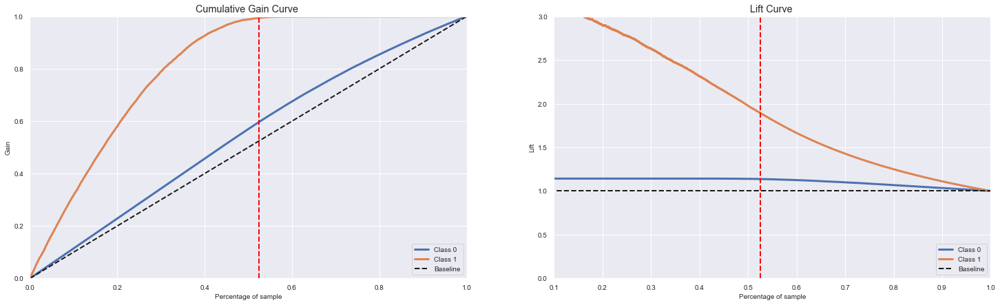

  

## 1. Problema de Negócio:
A Shield Insurance é uma empresa que oferece seguro de saúde para seus clientes e a equipe de produto esta analisando a possibilidade de oferecer um novo produto: o seguro de automóvel. Assim como já acontece com o seguro de saúde, os clientes dessa nova modalidade precisam pagar um valor anualmente para que tenham direito a ser indenizado caso aconteça algum acidente ou dano ao seu veículo.

Através de uma pesquisa realizada pela empresa, pouco mais de 380.000 clientes responderam um questionário e informaram o interesse ou não no novo produto. Esses dados foram guardados em um banco de dados junto com outros atributos do cliente.

A equipe de produtos selecionou 127 mil novos clientes que não responderam à pesquisa para participar de uma campanha, na qual receberão a oferta do novo produto de seguro de automóveis. A oferta será feita pela equipe de vendas por meio de ligações telefônicas, e conseguirá entrar em contato com apenas 20.000 durante o período da campanha.

Diante da dificuldade da equipe de vendas em não conseguir entrar em contato com todos os clientes, surgiu a necessidade em criar uma solução que classifique todos com base em sua probabilidade de aquisição do produto. Essa solução será um modelo de aprendizado de máquina que ficará disponivel em uma API, podendo ser utilizada pela equipe de vendas para priorizar as pessoas com maior interesse no novo produto e, assim, otimizar a campanha fazendo contato com os cliente com maior propenção de compra.

Ao final do projeto, um relatório será entregue contendo análise e respondendo as seguintes perguntas de negócio:

- Quais são os atributos mais relevantes dos clientes interessados em adquirir um seguro de automóvel?
- Que porcentagem de clientes interessados em comprar seguro de automóveis a equipe de vendas poderá atingir com 20.000 ligações?
- E se a capacidade da equipe de vendas aumentar para 40.000 ligações, qual percentual de clientes interessados em adquirir um seguro de automóvel a equipe de vendas poderá contatar?

## 2. Descrição dos dados:

Os dados foram disponibilizados pela empresa dentro da plataforma de competições [Kaggle](https://www.kaggle.com/datasets/anmolkumar/health-insurance-cross-sell-prediction). A base contem 381.109 clientes cadastrados que responderam a pesquisa, contendo 12 atributos conforme listado abaixo:

| Atributo                       | Descrição                                                      |
| -------------------------------- | ------------------------------------------------------------ |
| id                               | Identificado único do cliente. |
| gender                           | Gênero do cliente.                                   |
| age                              | Idade do cliente.                             |
| driving_license                  | Cliente possui carteira de motorista, 0 = nao possui, 1 = possui.                    |
| region_code                      | Código da região do cliente. |
| previously_insured               | Cliente possui seguro de sáude, 0 = nao possui, 1 = possui |
| vehicle_age                      | Idade do veículo. |
| vehicle_damage                   | Identificador se o véiculo foi danificado no passado  |
| annual_premium                   | O valor que o cliente precisa pagar anualmente como prêmio.|
| policy_sales_channel             | Código para o canal de contato com o cliente.        |
| vintage                          | Número de dias que o cliente foi associado a empresa. |
| response                         | Cliente esta interessado no seguro, 0 = não, 1 = sim.       |

## 3. Estratégia de Solução:

Para desenvolvimento da solução foi utilizado o processo de modelagem chamado CRISP-DM. Sua natureza cíclica permite não só a refatoração do código como também a formulação de outras hipóteses e melhora dos modelos ao longo de cada ciclo.

### Passos do CRISP-DM:
1. **Data description:**Coletar os dados e compreender o significado de cada atributo dos interessados. Utilizar métricas estatísticas para fornecer uma visão geral dos dados.

2. **Feature Engineering:** Derivar novos atributos com base nas variáveis originais visando melhor descrever o fenômeno a ser modelado.

3. **Data Filtering:** Filtrar registros e atributos de acordo com restrições de negócio.

4. **Exploratory Data Analysis (EDA):** Realizar análise bivariada e multivariada avaliando detalhes de cada atributo. Criar hipóteses e gerar insights de negócio.

5. **Data Preparation:** Separar dados de treino e validação e preparar os dados para que os modelos de aprendizado de máquina possam aprender o comportamento específico.

6. **Feature Sellection:** Seleção de atributos mais significativos para o treinamento do modelo.

7. **Machine Learning Modeling** Treinamento do modelo de aprendizado de máquina.

7. **Hyperparameter Fine Tuning** Buscar os melhores parâmetros do modelo de melhor desempenho selecionado na etapa anterior. 

8. **Conversão do desempenho do modelo em valores de negócios** Responder as questões de negócio e converter o desempenho do modelo em resultado de negócios. Comparar resultados da lista aleatória com a lista ordenada por propensão de compra.

9. **Modelo em produção:**Publicar o modelo em um ambiente de nuvem para que outras pessoas ou serviços possam usar os resultados para melhorar a decisão de negócios.

10. **Previsão por Google Sheets** Criação de botão na planilha do Google Sheets para mostrar Score do cliente.

## 4. EDA Insights

### 1: Homens tem mais interesse em adquirir o seguro em relação as mulheres.

)

### 2: Clientes com faixa etária entre 40 e 50 anos tem mais interesse em adquirir seguro de automóvel.

### 3: Clientes que tiveram veículo danificado no passado tem maior propensão em adquirir o seguro de automóvel.

# 5. Modelos de Machine Learning

## 5.1 Métricas:

Para esse projeto que trata-se de um problema de "learn to rank" as métricas escolhidas para avaliação do nosso modelo foram as seguintes: 

- **Precisão@K:** Propoção de clientes recomendados no conjunto K que são relevantes dada pela fórmula:

- **Recall@K:** Proporção de clientes relevantes no conjunto K, dado pela fórmula:

- **Curva ROC-AUC:** O ROC AUC indica o quão bom seu modelo é em ranquear exemplos positivos acima dos exemplos negativos. ROC é uma curva de probabilidade e AUC representa o grau ou medida de separabilidade. A curva ROC é plotada com TPR (True Positive Rate) contra FPR (False Positive Rate) onde TPR está no eixo y e FPR está no eixo x.

## 5.2 Resultados:

###Single Performance:

| Model Name | Model Accuracy | Precision @K | Recall @K | ROC AUC Score | Top K Score |
|  --------- | -------------- | ------------ | --------- | ------------- | ----------- |
| LGBMClassifier | 0.874761 | 0.343133 | 0.720676 | 0.857903 | 0.874761 |
| XGBClassifier | 0.874892 | 0.340933 | 0.716056  | 0.856461 | 0.874892 |
| CatBoostClassifier | 0.874498 | 0.340833 | 0.715846  | 0.856752 | 0.874498 |
| RandomForestClassifier | 0.864094 | 0.319434| 0.670902  | 0.838271| 0.864094 |
| KNeighborsClassifier | 0.858020 | 0.299635 | 0.629318  | 0.782844 | 0.858020 |
| LogisticRegression | 0.875062 | 0.288686 | 0.606322 | 0.817302 | 0.875062 |

### Cross Validation Performance:

| Model Name | Model Accuracy | Precision @K | Recall @K | ROC AUC Score | Top K Score |
|  --------- | -------------- | ------------ | --------- | ------------- | ----------- |
| LGBMClassifier CV | 0.5+/-0.0 | 0.308+/-0.002| 0.828+/-0.005 | 0.854+/-0.002 | 0.878+/-0.0 |
| CatBoostClassifier CV  | 0.505+/-0.001 | 0.308+/-0.001| 0.828+/-0.003 | 0.853+/-0.001 | 0.877+/-0.0 |
| XGBClassifier  CV | 0.505+/-0.001 | 0.307+/-0.001 | 0.826+/-0.004  | 0.852+/-0.001 | 0.877+/-0.0 |
| RandomForestClassifier CV | 0.542+/-0.001 | 0.291+/-0.001 | 0.782+/-0.003  | 0.833+/-0.001 | 0.866+/-0.001 |
| LogisticRegression CV | 0.5+/-0.0	 | 0.275+/-0.002 | 0.739+/-0.005  | 0.818+/-0.002 | 0.878+/-0.0 |
| KNeighborsClassifier CV | 0.547+/-0.001| 0.273+/-0.001 | 0.734+/-0.002 | 0.782+/-0.0 | 0.861+/-0.0 |

### Modelo final (Tunned Model) :

O modelo final escolhido para esse projeto foi o LGBMClassifier. Além de obtermos resultados melhores , esse modelo tem melhor relação tamanho-velocidade em comparação aos demais. Para ajuste final dos parametros foi utilizado o framework Otptuna, onde foi obtido uma pequena melhora na performance.

| Model Name | Model Accuracy | Precision @K | Recall @K | ROC AUC Score | Top K Score |
|  --------- | -------------- | ------------ | --------- | ------------- | ----------- |
| LGBMClassifier CV | 0.502+/-0.0 | 0.309+/-0.001| 0.831+/-0.004 | 0.855+/-0.002 | 0.878+/-0.0 |

# 6. Resultado Final

Ao final do projeto, foi possível responder as seguintes perguntas de negócio:

- **Quais são os atributos mais relevantes dos clientes interessados em adquirir um seguro de automóvel?**

	**R:** De acordo com a análise os atributos selecionados para aplicação do modelo foram:
    - vintage
    - annual_premium
    - age
    - region_code
    - policy_sales_channel
    - vehicle_damage
    - previously_insured

- **Que porcentagem de clientes interessados em comprar seguro de automóveis a equipe de vendas poderá atingir com 20.000 ligações?**

	**R:** A equipe de vendas conseguirá atingir 72,12% das pessoas interessadas entrando em contato com 20.000 clientes(26,24% do conjunto total dos dados de validação). Observando o gráfico da "Lift Curve" podemos concluir que o modelo é aproximadamente 2,75 vezes melhor que uma escolha aleatória.

- **E se a capacidade da equipe de vendas aumentar para 40.000 ligações, qual percentual de clientes interessados em adquirir um seguro de automóvel a equipe de vendas poderá contatar?**

	**R:** Dentro desse cenário a equipe entraria em contato com 52,48% do total de clientes do nosso conjunto de dados e atingiria 99,41% das pessoas interessadas. Podemos concluir de acordo com o gráfico "Lift Curve" que com 40.000 contatos nosso modelo é cerca 1,9 vezes melhor que uma escolha aleatória

# 6. Deploy

# 7. Conclusão

Ao final do projeto, podemos concluir que com o modelo proposto a equipe de vendas poderá ser mais acertiva no contato com os clientes, focando primeiramente naqueles com maior propensão de compra. Isso reduzirá o custo de aquisição de clientes e aumentar o faturamento da empresa.

A solução entregue via google sheets permite a possibilidade de utilizar uma nova base de dados, podendo simular perfis de clientes e gerar novas análises pertinentes ao negócio.

# 8. Próximos passos

- Utilizar técnicas de balanceamento de dados.
- Coletar mais dados dos clientes e/ou criar novas features afim de melhorar a performance do modelo.
- Utilizar método mais robusto para encontrar os melhores parâmetros para o modelo.

